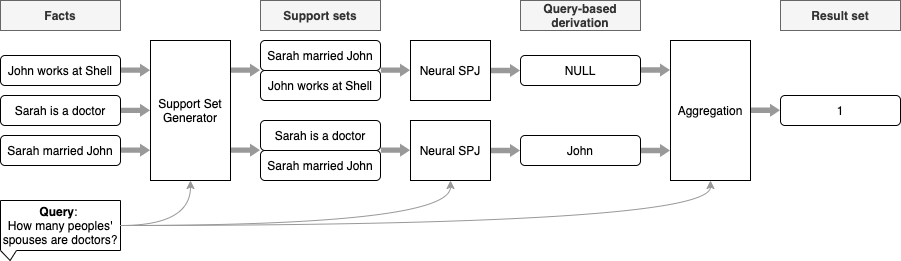

<!--
Copyright (c) 2021 Facebook, Inc. and its affiliates.

This file is part of NeuralDB.
See https://github.com/facebookresearch/NeuralDB for further info.

Licensed under the Apache License, Version 2.0 (the "License");
you may not use this file except in compliance with the License.
You may obtain a copy of the License at

    http://www.apache.org/licenses/LICENSE-2.0

Unless required by applicable law or agreed to in writing, software
distributed under the License is distributed on an "AS IS" BASIS,
WITHOUT WARRANTIES OR CONDITIONS OF ANY KIND, either express or implied.
See the License for the specific language governing permissions and
limitations under the License.
-->

# Database Reasoning over Text

This repository contains the code for the [Database Reasoning Over Text](https://arxiv.org/pdf/2106.01074.pdf) paper, 
to appear at ACL2021. Work is performed in collaboration with James Thorne, Majid Yazdani, Marzieh Saeidi, Fabrizio Silvestri, Sebastian Riedel, and Alon Halevy.




The code in this repository is released under the [Apache 2.0 license](LICENSE)

## Data
The completed datasets for NeuralDBs can be downloaded from this [S3 bucket](#TODO) and is released under a [CC BY-SA 3.0 license](https://creativecommons.org/licenses/by-sa/2.0/).


The dataset includes entity names from Wikidata which are released under a [CC BY-SA 3.0 license](https://creativecommons.org/licenses/by-sa/3.0/) license.
This dataset includes sentences from the KELM corpus. KELM is released under the [CC BY-SA 2.0 license](https://creativecommons.org/licenses/by-sa/2.0/)


## Repository Structure
The repository is structured in 3 sub-folders:

* Tools for mapping the KELM data to Wikidata identifiers are provided in the  [dataset construction](dataset-construction/) folder ,
* The information retrieval system for the support set generator are provided in the [ssg](ssg/) folder
* The models for Neural SPJ, the baseline retrieval (TF-IDF and DPR), and evaluation scripts are provided in the [modelling folder](modelling/).

Instructions for running each component are provided in the README files in the respective sub-folders.

## Setup

All sub-folders were set up with one Python environment per folder. Requirements for each environment can be installed by
running a pip install:

```
pip install -r requirements.txt
```

In the `dataset-construction` and `modelling` folders, the `src` folder should be included in the python path.

```
export PYTHONPATH=src
```